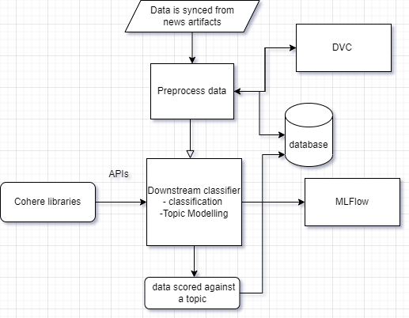

## Topic Modeling Using Cohere's GPT3

Using cohere's APIs, I explore the use of large language models like GPT3, to perform topic modelling and classification.

A client has a system that collects News artifacts from the web, and is trying to explore if tools like GPT3 will be important to help classify the documents to their topics. He wants to score a few of these news items in the range from 0 to 10; a score of 0 means the news item is totally NOT relevant while a score of 10 means the news item is very relevant. The range of results between 0 and 10 signifies the degree of relevance of the news item to the topic
## MLOps Pipeline Design

## Folder structure
.github- github workflows

Notebooks- contains notebooks workflows

scripts- contains scripts to the project

tests- user tests for scripts

.gitignore- files to be ignored when pushing to github

license- MIT License

README.md- contains project preview

requirements.txt- packages needed for the project

## How to install this application
pip install -r requirements.txt

streamlit run dashboard.py

cohere API- nidVfcm5xYEyW8etrREYrKmXjcdD65sCGVhxRJOl

